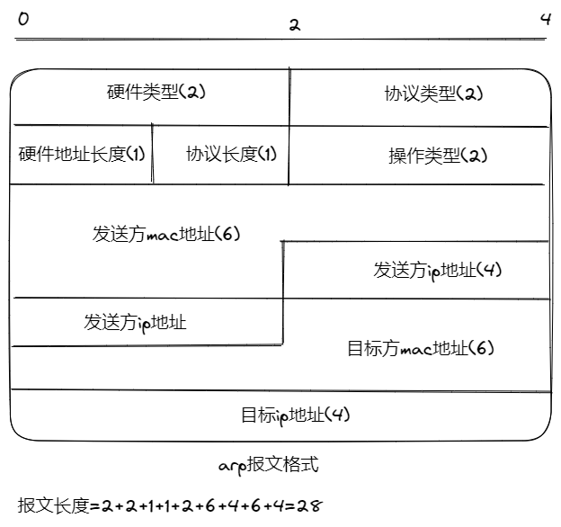

# arp协议

## 概念

地址解析协议，即ARP（Address Resolution Protocol），是根据IP地址获取物理地址的一个TCP/IP协议。

## 过程

1. 主机发送信息时将包含目标IP地址的ARP请求广播到局域网络上的所有主机，并接收返回消息，以此确定目标的物理地址；收到返回消息后将该IP地址和物理地址存入本机ARP缓存中并保留一定时间，下次请求时直接查询ARP缓存以节约资源。
2. 地址解析协议是建立在网络中各个主机互相信任的基础上的，局域网络上的主机可以自主发送ARP应答消息，其他主机收到应答报文时不会检测该报文的真实性就会将其记入本机ARP缓存；

## arp报文格式

arp报文长度为28字节,MAC 地址长度为 6 字节，IP 地址长度为 4 字节

